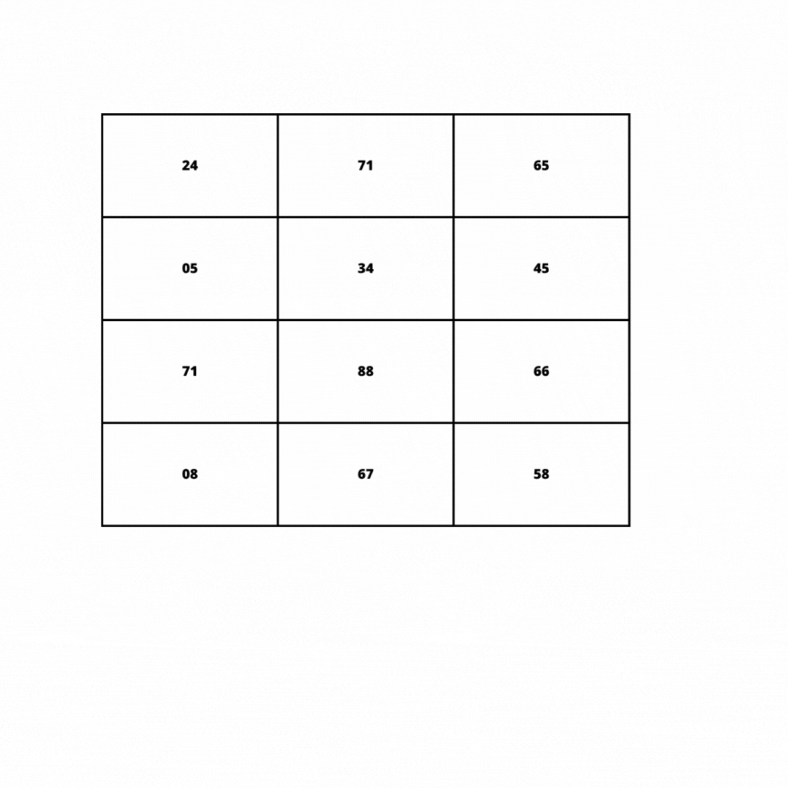
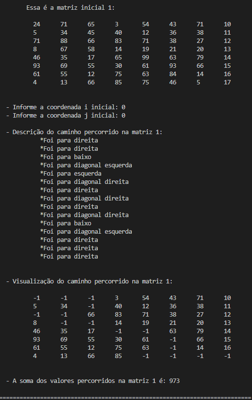
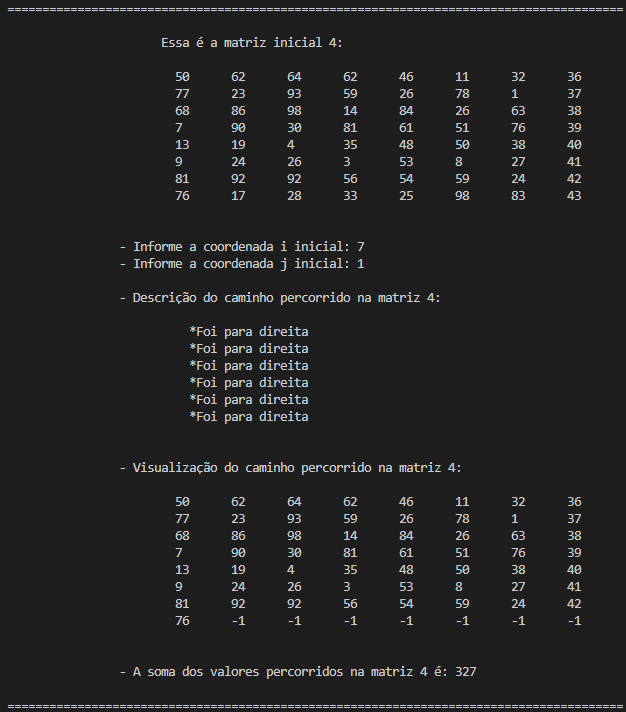

# Caminho Guloso

[](https://cplusplus.com)
[](https://code.visualstudio.com/docs/?dv=linux64_deb)


---
 
## Problema

<p align=justify> 
<strong>

- [X] 1.  Criar um sistema que leia K matrizes quadradas no tamanho NxN.

- [X] 2.  Seu programa deve enumerá-las, de forma a deixa-las organizadas para processamento. 

- [X] 3.  Partindo da primeira matriz, você deve iniciar de um ponto preestabelecido, esse pode ser fornecido pelo usuário ou estar contido em arquivos extras de configuração. Não é permitido definir diretamente no código. 

- [X] 4.  A partir da primeira matriz, você tem como regras: (a) avançar para a próxima coluna; (b) retroceder para coluna anterior; (c)  saltar para a linha de baixo; (d) ir em diagonal para baixo. Todas essas regras só se aplicam se a casa (posição i,j da matriz) ainda não tenha sido descoberta ou já processada. 

- [X] 5.  Para caminhar você deve sempre optar pelo valor da próxima casa, valor esse que deve ser o maior dentre eles. Caso haja empate entre casas, crie uma regra para adotar sempre uma mesma decisão de caminhamento. 

- [X] 6.  Ao alcançar a última linha e coluna da matriz, selecione a próxima matriz e repita todo o processo novamente. Por fim, apresente ao usuário qual foi o caminho adotado e qual a soma obtida do caminho realizado. 
</strong>
</p>

---
## Implementação


> No decorrer do curso, é muito provável que, em algum momento, vamos utilizar o conceito de caminhamento em matrizes de forma gulosa para realizar os trabalhos propostos, ou seja, optando por um caminho e não mais olhando para trás ou para decisões já tomadas. Neste trabalho vamos caminhar por um conjunto de matrizes fornecidas como entrada, objetivando encontrar o maior valor final.


<p align=justify>Foi implementado um menu simples que permite ao usuário inserir os valores <strong>i</strong> e <strong>j</strong> correspondentes às linhas e colunas da matriz, respectivamente. A partir da posição inicial informada pelo usuário, o algoritmo visualiza o valor à direita, retornando-o para a função:

 ```ruby
void 'imprime_matriz'(Valor x[N][N]) {
    for (int i = 0; i < N; i++) {
        cout << "\t\t\t";

        for (int j = 0; j < N; j++) {
            cout << x[i][j].val << "\t";
        }

        cout << endl;
    }

    cout << endl << endl;
}

int 'obter_valor_direita'(Valor x[N][N], int i, int j){
    int valor_direita = 0;

    if (j <= (N - 2)) {
        valor_direita = x[i][j + 1].val;
    }

    return valor_direita;
}
```

Visando garantir que o algoritmo não encontre casas vazias ou de valores menores durante a busca do caminho a matriz, foram criadas diversas condições. Dessa forma, foram priorizados os seguintes caminhos:

 ```ruby
int 'obter_valor_direita'(Valor x[N][N], int i, int j);
int 'obter_valor_esquerda'(Valor x[N][N], int i, int j);
int 'obter_valor_baixo'(Valor x[N][N], int i, int j);
int 'obter_valor_diagonal_direita'(Valor x[N][N], int i, int j);
int 'obter_valor_diagonal_esquerda'(Valor x[N][N], int i, int j);
```


   As funções, são responsáveis ​​por retornar o valor de um elemento da matriz em uma determinada posição, dado o elemento atual. Elas recebem como parâmetros a matriz x, o índice <strong>i</strong> da linha e o índice <strong>j</strong>da coluna do elemento atual, e retornam o valor do elemento à direita, à esquerda, abaixo, à diagonal direita e à diagonal esquerda, respectivamente. E então tem se o maior valor para prosseguir. 

</p>
Por exemplo, a função obter_valor_direita()retorna o valor do elemento que está imediatamente à direita do elemento atual, se existir. Caso contrário, retorna 0, verificando assim apenas as casas adjacentes. E se acontecer de ter número iguais a função utilizada é a seguinte:  </p>


>    `decisão` 'decisao = checar_valores_iguais(valor_direita, valor_esquerda, valor_baixo,  valor_diagonal_direita, valor_diagonal_esquerda);

E se ocorrer de ter valores iguais, o algoritmo vai prosseguir para o valor da direita, respeitando a ordem de prioridade definida  no codigo.

<p>O programa consiste em um loop, onde:

    1. São verificados os 5 moviemntos possíveis;
    2. São verificados se o proximo movimento pode ser realizado;
    3. Que não esteja na ultima linha, pois caso esteja, o único movimento permitido é o para direita;
    4. Coletar os valores dos movimentos realizados e assim apresentar a soma do percurso;
    5. Movimentar para o valor maior, ignorando apenas o valor acima. 


As prioridades foram definidas da seguinte forma: 

```sh
        vector_decisao.push_back(valor_direita); // 0
        vector_decisao.push_back(valor_esquerda); // 1
        vector_decisao.push_back(valor_baixo); // 2
        vector_decisao.push_back(valor_diagonal_direita); // 3 
        vector_decisao.push_back(valor_diagonal_esquerda); //4
```
</p>

### Exemplo

<p align = justify> 
 
 Exemplificando e completando toda a lógica apresentada acima, demonstrarei através de um .gif, o caminho  a ser percorrido.




 A matriz apresentada é uma matriz 3x4, apenas um exemplo.

Iniciando na posição <strong>i = 0 e j = 0 </strong>
Nossas possibilidades são: direita, diagonal direita e para baixo

Dentro das possibilidades, escolhemos aquele de maior valor e vamos para direita


</p>


---
## Resultados Testes
<p align=justify> O algoritmo busca os valores da matriz no arquivo matrizes.txt, arquivo que possui 320 caractres, sendo possivel modificar o tamanho da matriz no define, que inicialmente foi de 8x8, o que possibilitou definir a partir do tamanho já declarado o inicio das proximas matrizes.

Arquivo de entrada, 'matrizes.txt:'

```sh
24;71;65;03;54;43;71;10;
05;34;45;40;12;36;38;11;
71;88;66;83;71;38;27;12;
08;67;58;14;19;21;20;13;
46;35;17;65;99;63;79;14;
93;69;55;30;61;93;66;15;
61;55;12;75;63;84;14;16;
04;13;66;85;75;46;05;17;
93;90;65;54;88;19;82;18;
13;53;34;29;98;54;22;19;
63;02;26;12;63;54;73;20;
21;01;68;87;19;33;87;22;
33;21;39;45;40;60;80;23;
49;58;01;31;20;98;78;24;
87;81;16;18;21;47;66;25;
14;26;10;04;75;16;61;26;
55;63;73;23;48;44;04;27;
84;11;01;96;76;61;98;28;
34;44;11;20;57;59;26;29;
42;61;35;39;19;41;03;30;
18;97;03;31;69;28;07;32;
85;72;43;14;52;16;96;33;
20;68;66;29;86;47;81;34;
44;28;96;02;68;94;15;35;
50;62;64;62;46;11;32;36;
77;23;93;59;26;78;01;37;
68;86;98;14;84;26;63;38;
07;90;30;81;61;51;76;39;
13;19;04;35;48;50;38;40;
09;24;26;03;53;08;27;41;
81;92;92;56;54;59;24;42;
76;17;28;33;25;98;83;43;
93;31;60;89;45;42;35;44;
73;16;26;66;52;24;39;45;
49;82;22;48;86;84;80;46;
40;95;30;74;71;30;85;47;
10;74;95;79;82;84;60;63;
20;01;87;03;71;88;48;64;
83;80;09;99;77;17;57;65;
43;28;74;07;84;64;16;80;
```
Executando o algoritmo,  informamos o valor de <strong>i e j.</strong>

Após inserir os valores temos a seguinte matriz gerada:
 </p>


<p align=justify> </p>

Testando mais uma das condições solicitadas, ao percorrer a matriz até sua última linha, ele continua para a direita até que o arquivo seja completamente percorrido. Em seguida, as matrizes são exibidas, evidenciando o caminho percorrido com a marcação <strong>'-1'</strong> e a soma total de todo o trajeto é printado na tela contendo todas as coordenadas e decisões do algoritmo.



---
---

## Bibliotecas

```sh
#include <iostream>
#include <string>
#include <fstream>
#include <vector>
```

---

## Compilação e Execução

<p align="justify">O exercício disponibilizado possui um arquivo Makefile cedido pelo professor que realiza todo o procedimento de compilação e execução. Para tanto, temos as seguintes diretrizes de execução:</p>


| Comando                |  Função                                                                                           |                     
| -----------------------| ------------------------------------------------------------------------------------------------- |
|  `make clean`          | Apaga a última compilação realizada contida na pasta build                                        |
|  `make`                | Executa a compilação do programa utilizando o gcc, e o resultado vai para a pasta build           |
|  `make run`            | Executa o programa da pasta build após a realização da compilação                                 |
